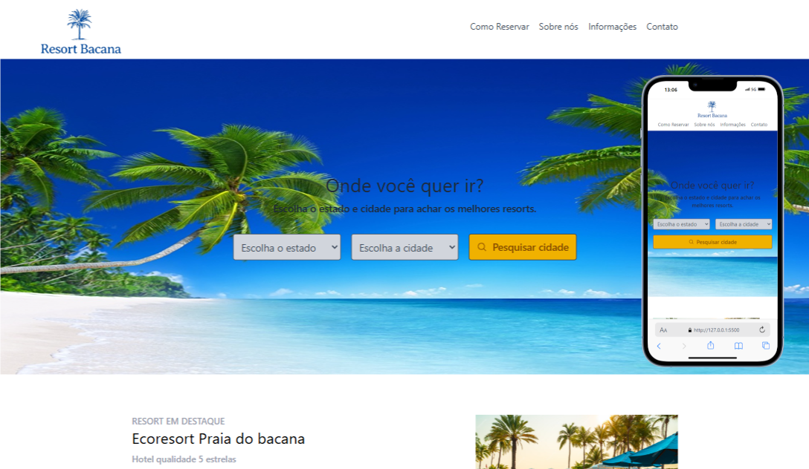
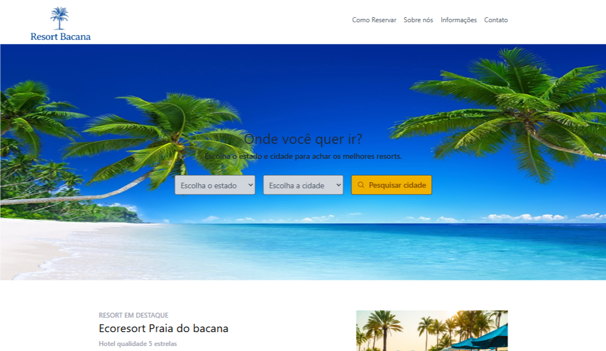

# RESORT BACANA



## Descrição 
Pagina frontal de uma page de Resort, funcionando como uma espécie de grupo, que o usuário buscaria um paradeiro nos diversos lugares que possuem parceria com este resort, tem como objetivo proporcionar uma experiência única, auxiliando o usuário na escolha da hospedagem ideal para momentos de descanso e diversão. 

## Demostração do Layout 



## Como Utilizar 

1. **Clone o Repositório**

```bash
 git clone ENDEREÇO REPOSITÓRIO
```
2. **Rodar**
- Entrar na pasta raiz utilizando terminal !
```bash
cd PASTA

 npm run dev
```


## Tecnologias Utilizadas 

1.React 

2.TailWind 

## Autor

[Abreeu](https://www.linkedin.com/in/abreeu/)


## Licença

Este projeto está sob a licença MIT. Você é livre para usá-lo como quiser, tanto para uso pessoal quanto comercial.


